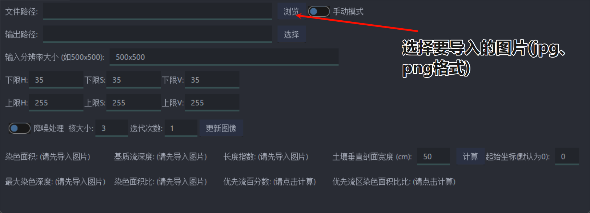
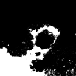
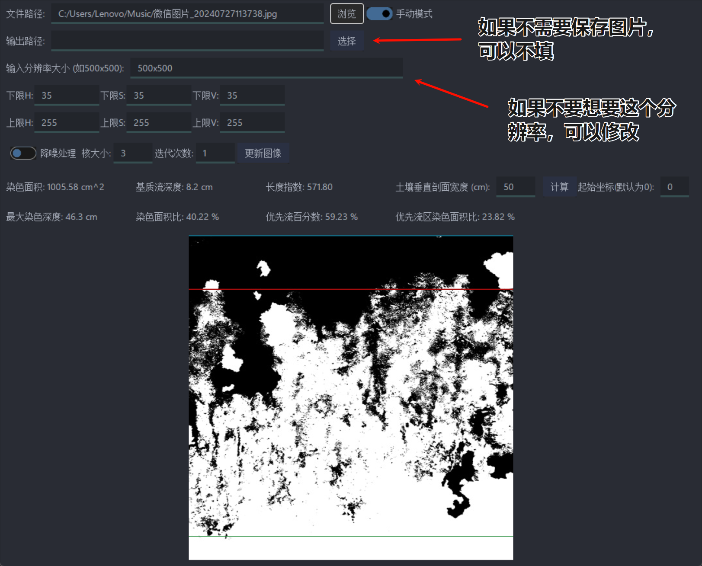
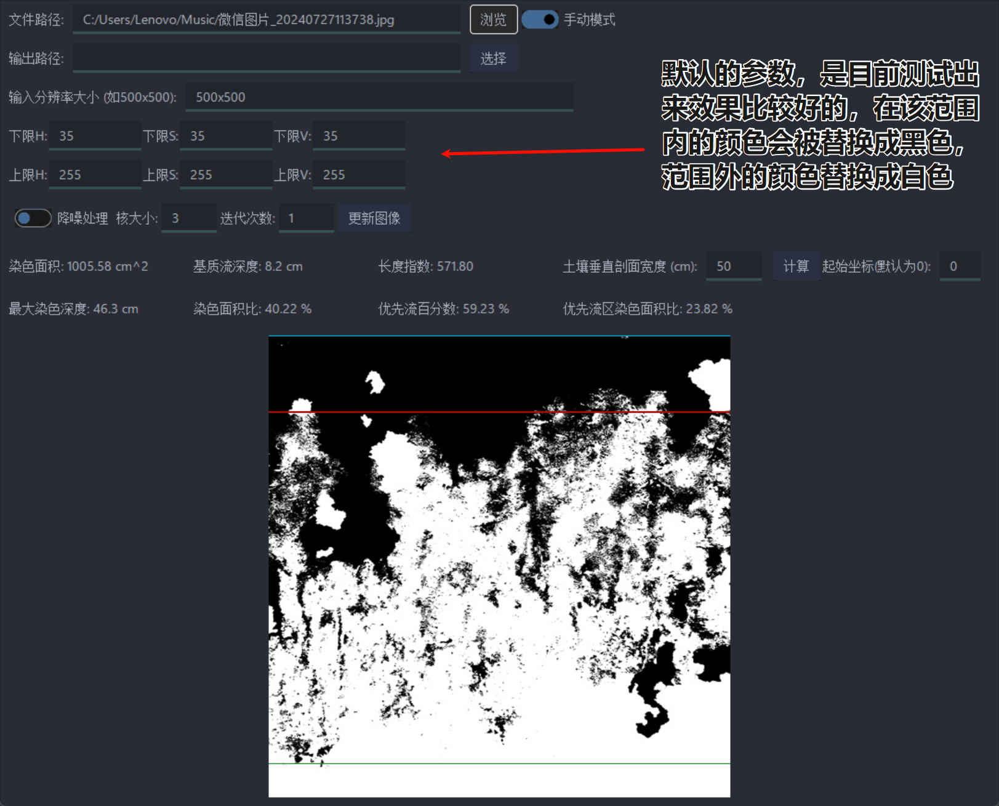
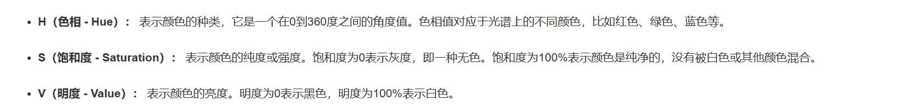
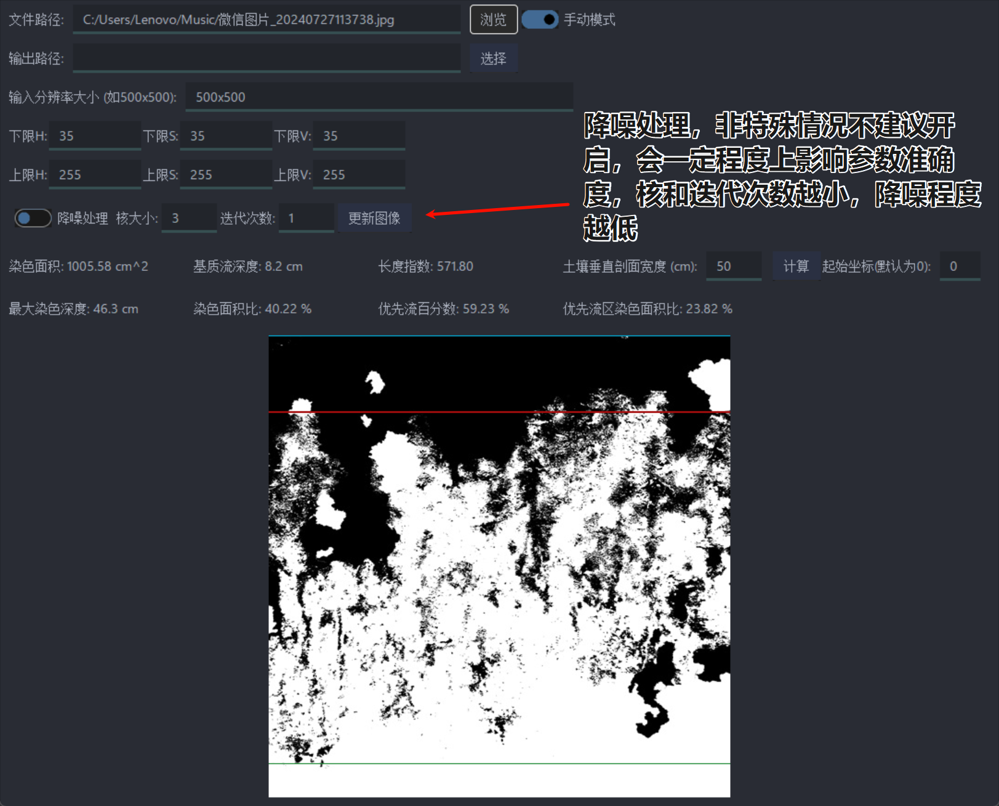
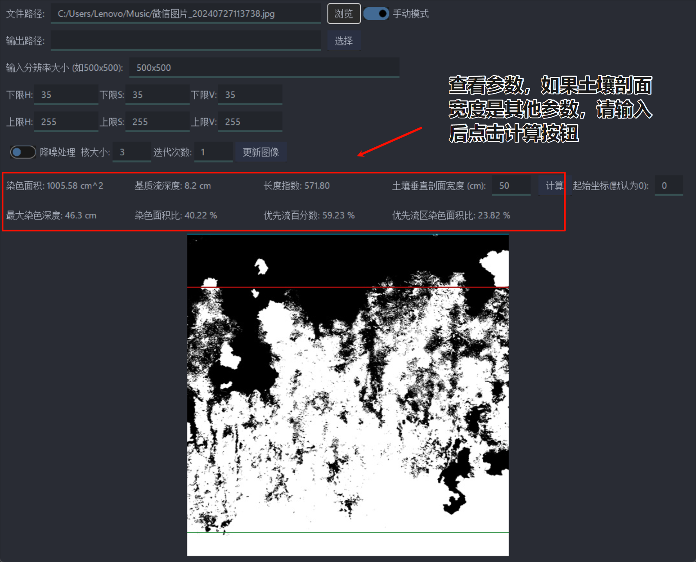
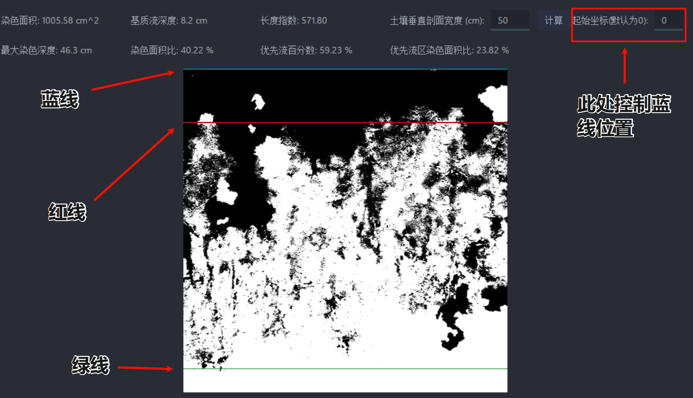

# 第一步

__注意！未开启手动模式的情况下，请选择未转换成灰度图的图片，该图片分辨率最好大于500x500，若选择图片分辨率小于500x500则图像处理效果不好__

**如果开启手动模式，请选择已经处理好的图片，如：建议分辨率为500x500**

# 第二步

# 第三步 （调整HSV阈值）

H、S、V的下限越低，图中被染色面积就越多，可以多次尝试，自行调整（不建议调整）

### 关于HSV,可以自行去相关在线网站搜索，调整阈值

# 第四步

# 第五步

# 第六步（核对图像）

### 红线为基流质深度位置，也就是第一次染色面积小于8O%的位置 

### 蓝线为开始寻找基流质深度的位置，也就是从红线是从蓝线位置之下开始寻找的（坐标范围0~499）

### 绿线为最大染色深度的位置 